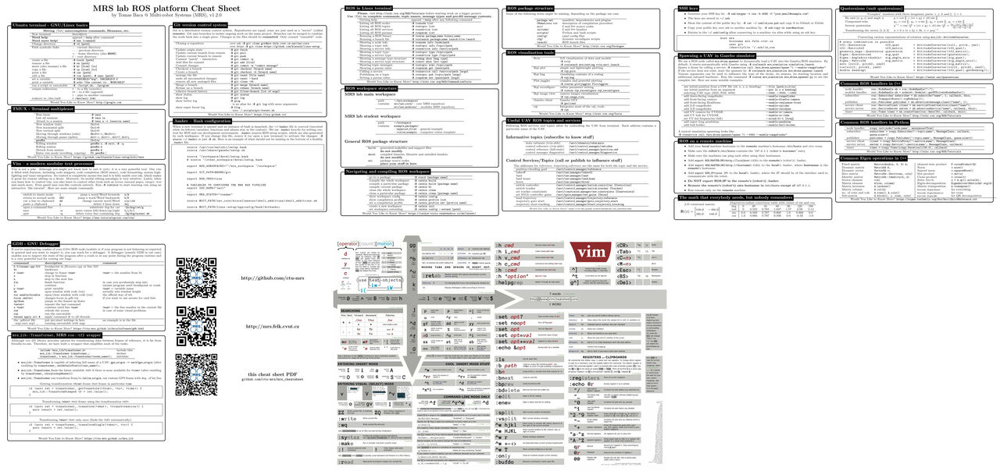

# MRS Cheatsheet

Are you new to our lab? Or just a stranger from the internet? Print this cheat sheet and you will be happy!

| Compilation status |  |

Click to download the pdf:

The cheatsheet covers the basics for daily use of
  * Linux terminal (Bash),
  * Tmux,
  * Vim,
  * Git,
  * .bashrc,
  * ROS in terminal,
  * ROS in C++ and Python,
  * Eigen,
  * and basic Maths used in robotics.
